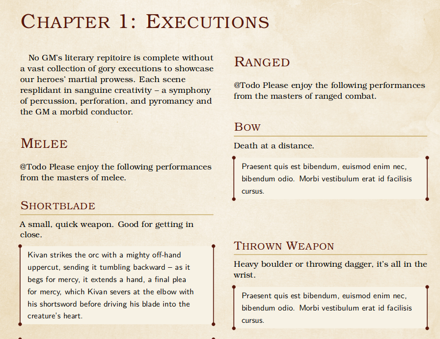

# D&D Vignettes

Welcome to D&D Vignettes, what I hope might be a community project to build a colorful compendium of vignettes for D&D players and dungeon masters alike.

First of all, huge thanks to [DND-5e-LaTeX-Template](https://github.com/evanbergeron/DND-5e-LaTeX-Template) for such a brilliant medium.

This project looks to compile creative one or two sentence vignettes to bring the D&D experience to life. Whether as a primer for a session, inspiration at the table, or a part of your design and planning sessions, this compendium humbly seeks to stoke your imagination.

### Layout



The project is written in Latex, and accepts all pull requests. Add new chapters, sections, subsections, and individual vignettes at your pleasure. Be sure to add whatever alias you want credited for your work in your commit message (use "Anonymous" if you do not want to be credited in the document).

A rough outline of the vignettes is as follows (browse the source for a more detailed layout):

#### Chapter 1 : Executions
* Magic
* Melee
* Monsters
* Ranged
#### Chapter 2 : Introductions
* Heroes
* Villians
#### Chapter 3 : Descriptions
* Dungeons (Crypts, 
* Towns


### Building

The only tested method of building this project is via `pdflatex` on Linux (Ubuntu).

```
pdflatex vignettes.tex
```
